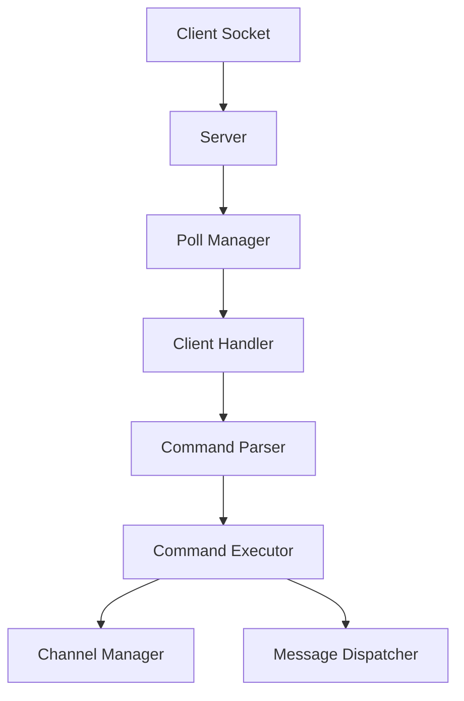

# 💬 ft_irc  
**An IRC server implemented in C++ according to RFC 1459.**


---

## 📌 Overview  
**ft_irc** is a fully functional Internet Relay Chat (IRC) server written in C++.  
It follows the **IRC RFC 1459 standard**, handles multiple clients, channels, user modes, and implements essential IRC commands.

This project aims to provide a deep understanding of **network programming**, **socket management**, and **asynchronous communication**.

---

## ✨ Features  
- 🔗 **TCP server** supporting multiple simultaneous clients  
- 🧵 Non-blocking I/O using `poll()`  
- 💬 Channel management (creation, join, leave, topic, modes)  
- 👥 Nickname & username registration  
- 🔐 Password-protected server  
- 📢 Broadcast and private messaging  
- 🛠 Full support for essential RFC1459 commands:  
  - `NICK`, `USER`, `JOIN`, `PART`, `PRIVMSG`, `NOTICE`  
  - `PING`, `PONG`, `QUIT`  
  - `KICK`, `TOPIC`, `MODE`  
- 🚫 Error handling and RFC-compliant replies  
- 🧹 Clean, modular code structure in OOP C++

---

## 🗂 Project Structure  
```
ft_irc/
│── src/
│   ├── server/
│   ├── client/
│   ├── channel/
│   ├── commands/
│   └── utils/
│── include/
│── Makefile
└── README.md
```

---

## 🧠 Architecture (Mermaid Diagram)



---

## 🚀 Installation

### 1️⃣ Clone the repository  
```bash
git clone https://github.com/yourusername/ft_irc.git
cd ft_irc
```

### 2️⃣ Build the project  
```bash
make
```

---

## ▶️ Usage

### Start the server  
```bash
./ircserv <port> <password>
```

Example:  
```bash
./ircserv 6667 1234
```

### Connect using an IRC client  
You can use any IRC client, for example:  
- LimeChat  
- irssi  
- netcat (for testing)  
- KiwiIRC  
- HexChat  

Example with **netcat**:  
```bash
nc localhost 6667
```

Example with **irssi**:  
```bash
irssi -c localhost -p 6667
```

---

## 🧪 Supported Commands  
### User Commands
- `NICK <nickname>`
- `USER <username> <mode> * :<realname>`
- `PRIVMSG <target> :<message>`
- `NOTICE <target> :<message>`
- `QUIT [message]`

### Channel Commands
- `JOIN <channel>`
- `PART <channel>`
- `TOPIC <channel> [:topic]`
- `KICK <channel> <user> :reason`
- `MODE <channel> <flags> [args]`

---

## 🧹 Cleanup  
```bash
make clean     # remove objects  
make fclean    # remove binaries  
make re        # rebuild  
```

---

## 👨‍💻 Authors  
[@bronIIcode](https://github.com/us3ph)

[@youssef](https://github.com/REGRAGUII)

[@hamza](https://github.com/TemsamaniHamza)

---

## 📄 License  
This project is licensed under the **MIT License**.
